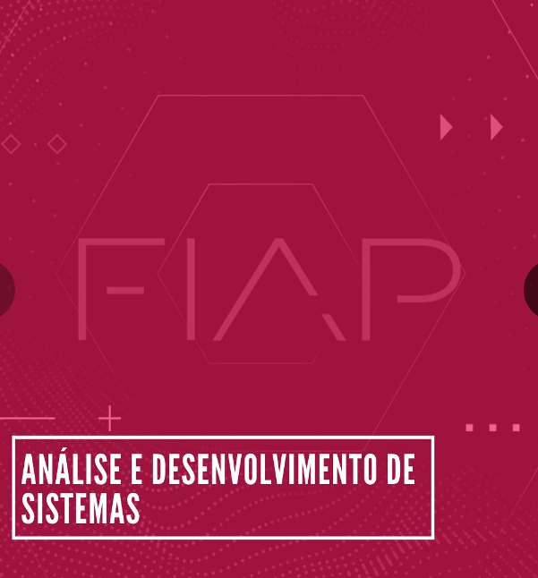

<h1> TDS - FIAP: Exercícios de desenvolvimento em Python </h1>

<h2>Soluções</h2>

Aqui estão compilados todos os exercícios realizados na linguagem Python durante o curso de Análise e Desenvolvimento de Sistemas na FIAP.

<h2>Linguagens e ferramentas</h2>
<ul>
<li>Python</li>
<li>VS Code</li>
</ul>

